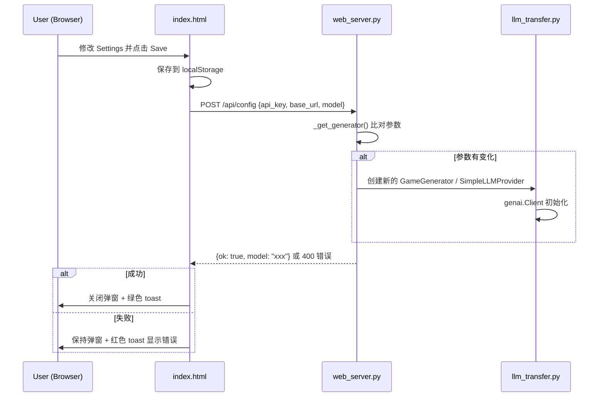

## User Requirements

用户反馈在 Web UI 的 Settings 中修改了 API Key / Base URL / Model 等设置后，仍然无法连接 LLM，设置不生效。

## Product Overview

修复 GodotVibe Web UI 的 LLM 配置流程，确保用户在 Settings 弹窗中修改任何配置参数后都能正确生效并连接 LLM。

## Core Features

1. **配置变更即时生效**：修改 API Key、Base URL、Model 中的任意一个参数后，后端都应重新创建 LLM 客户端，而不仅仅在 api_key 变化时重建
2. **保存设置时验证连通性**：前端 saveSettings() 保存配置后，自动调用 `/api/config` 接口验证 LLM 连通性，并向用户显示验证结果（成功/失败）
3. **合理的默认值处理**：默认 base_url 目前硬编码为内网地址 `http://turinglab-api.woa.com`，对外部用户造成困惑，需要在前端 placeholder 和后端默认值中移除该内网地址，改为空或通用提示
4. **验证中的加载状态**：保存设置时展示验证中的加载状态，避免用户重复点击

## Tech Stack

- 后端：Python FastAPI（现有项目栈）
- 前端：原生 HTML/CSS/JavaScript（现有项目栈，单文件 `index.html`）
- LLM SDK：google-genai（现有依赖）

## Implementation Approach

本次修复涉及三个文件的协调修改，核心策略是：

1. **后端 `_get_generator` 参数比对重建**：将当前仅检查 `api_key` 是否存在的简单判断，改为比对所有三个参数（api_key、base_url、model）是否与当前 generator 实例一致，任何不同都触发重建。使用缓存上次使用的参数来实现比对。
2. **前端 `saveSettings()` 异步验证**：保存后立即调用 `/api/config` POST 接口，根据返回结果显示 toast 提示（成功绿色/失败红色），同时在验证期间禁用保存按钮并显示加载状态。
3. **默认 base_url 空值处理**：后端 `llm_transfer.py` 中移除硬编码的内网默认地址，改为仅从环境变量读取，无环境变量时不设置（使用 SDK 默认值）；前端 placeholder 改为通用提示文字。

**关键决策**：

- 选择在 `_get_generator` 中用模块级变量缓存 `_last_config` 来比对参数变化，而非每次都重建（避免不必要的客户端重建开销）
- `/api/config` 接口增加实际的连通性测试（调用 `models.list` 或类似轻量接口），而非仅创建客户端就返回成功
- 前端验证失败时不关闭 Settings 弹窗，方便用户立即修正配置

## Implementation Notes

### 1. `web_server.py` — `_get_generator` 重建逻辑修复

- 新增模块级变量 `_last_config: dict | None = None` 记录上一次的 `(api_key, base_url, model)`
- `_get_generator` 比较当前传入参数与 `_last_config`，任何差异都重新实例化 `GameGenerator`
- 注意空字符串与 None 的等价处理（前端可能传空字符串）

### 2. `web_server.py` — `/api/config` 路由增强

- 在创建 generator 后，可尝试捕获创建过程中的异常（构造函数中 genai.Client 初始化失败即为连接异常）
- 当前的 try/except 已能捕获构造异常，无需额外的连通性测试 API 调用（genai SDK 创建 Client 时不会真正连接，但如果 api_key 为空会报错）
- 返回明确的 `model` 信息供前端展示

### 3. `static/index.html` — `saveSettings()` 改为异步验证

- 函数改为 `async function saveSettings()`
- 有 apiKey 时调用 `/api/config` 验证，无 apiKey 时仅保存本地（不验证）
- 验证期间：Save 按钮显示 "Validating..." 并 disabled
- 验证成功：关闭弹窗 + 绿色 toast "Settings saved & LLM connected (model: xxx)"
- 验证失败：不关闭弹窗 + 红色 toast 显示错误信息，方便用户修改

### 4. `llm_transfer.py` — 默认 base_url 修改

- 第 153 行 `os.getenv("GEMINI_BASE_URL", "http://turinglab-api.woa.com")` 改为 `os.getenv("GEMINI_BASE_URL")` 或 `os.getenv("GEMINI_BASE_URL", "")`
- 当 `effective_base_url` 为空/None 时，不设置 `http_options` 中的 `base_url`，让 SDK 使用其官方默认地址
- 前端 placeholder 从 `http://turinglab-api.woa.com` 改为 `https://generativelanguage.googleapis.com`（Gemini 官方地址）

### 5. 向后兼容

- 环境变量 `GEMINI_BASE_URL` 仍然优先生效，不影响已有部署
- 不改变 API 接口签名，仅修改内部行为

## Architecture Design

本次修改不引入新架构模式，仅修复现有数据流中的缺陷：



## Directory Structure

```
vibe_tools/
├── web_server.py           # [MODIFY] 修复 _get_generator 重建逻辑：新增 _last_config 参数比对，任何参数变化都触发 GameGenerator 重建；增强 /api/config 路由返回信息
├── llm_transfer.py         # [MODIFY] 移除硬编码内网默认 base_url，改为无环境变量时不设置 base_url（使用 SDK 默认）；当 base_url 为空时不传入 http_options 的 base_url
└── static/
    └── index.html          # [MODIFY] saveSettings() 改为异步函数，保存后调用 /api/config 验证连通性；添加验证加载状态；修改 base_url placeholder 为通用地址
```

## Key Code Structures

```python
# web_server.py — 新增参数比对逻辑
_last_config: dict | None = None  # {"api_key": ..., "base_url": ..., "model": ...}

def _get_generator(api_key: str | None = None, base_url: str | None = None, model: str | None = None) -> GameGenerator:
    global _generator, _last_config
    current_config = {
        "api_key": api_key or os.getenv("GEMINI_API_KEY"),
        "base_url": base_url or os.getenv("GEMINI_BASE_URL"),
        "model": model or os.getenv("GEMINI_MODEL", "gemini-2.5-flash"),
    }
    if _generator is None or _last_config != current_config:
        _generator = GameGenerator(**current_config)
        _last_config = current_config
    return _generator
```

## Agent Extensions

### SubAgent

- **code-explorer**
- Purpose: 在实现前确认 `genai.Client` 构造函数在无 `base_url` 时的默认行为，以及确认 `http_options` 参数结构
- Expected outcome: 确认 SDK 默认行为，确保移除 base_url 后 Client 仍可正常初始化