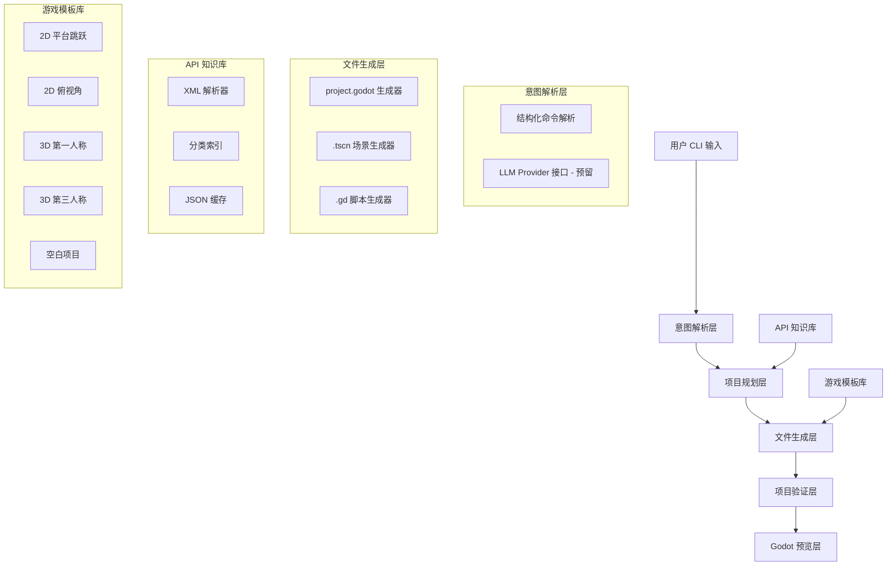

## 用户需求

用户希望基于已编译的 Godot Engine 4.7.0-dev，构建一个 "Vibe Coding" 游戏开发工具。用户通过自然语言描述游戏需求，工具自动调用 Godot 引擎的所有能力，生成可运行的完整游戏项目。

## 产品概述

GodotVibe 是一个基于 Python 的命令行/Web 交互工具，它充当用户自然语言与 Godot 引擎之间的桥梁。用户用自然语言描述想要的游戏（如"创建一个2D平台跳跃游戏，有一个可控角色和3个敌人"），工具自动解析意图，生成完整的 Godot 项目文件（project.godot、.tscn 场景、.gd 脚本），并可一键在 Godot 编辑器中预览运行。

## 核心功能

1. **Godot API 知识库构建**：解析 doc/classes/ 目录下 917 个 XML 文件，提取全部类、方法、属性、信号、常量信息，构建结构化的 API 知识库（JSON 格式），作为代码生成的基础参考
2. **项目生成引擎**：根据解析后的用户意图，程序化生成完整的 Godot 项目结构，包括 project.godot 配置文件、.tscn 场景树文件、.gd GDScript 脚本文件
3. **游戏模板系统**：预置常见游戏类型模板（2D 平台跳跃、2D 俯视角、3D 第一人称、3D 第三人称、GUI 应用等），每个模板包含标准场景结构和脚本骨架
4. **自然语言交互界面**：提供命令行交互界面，用户输入自然语言描述，系统输出生成计划并确认后执行生成
5. **一键预览运行**：生成完成后自动调用已编译的 Godot 编辑器（bin/godot.windows.editor.x86_64.exe）打开项目预览
6. **增量修改能力**：对已生成的项目支持自然语言增量修改，如"给角色添加双跳能力"、"把背景颜色改成蓝色"

## 技术栈

- **语言**: Python 3.11+（与项目 uv 环境一致）
- **环境管理**: uv（复用现有项目配置）
- **CLI 框架**: Rich（美化终端输出）+ Prompt Toolkit（交互式输入）
- **API 知识库**: 自研 XML 解析器（基于 Python xml.etree），输出 JSON
- **文件生成**: 自研 Godot 文件生成器（project.godot / .tscn / .gd）
- **Godot 集成**: subprocess 调用 bin/godot.windows.editor.x86_64.exe
- **LLM 集成预留**: 抽象 Provider 接口，便于后续接入 LLM API 实现真正的自然语言理解

## 实现方案

### 总体策略

采用 **分层管线架构**，将自然语言到 Godot 项目的转化过程拆解为清晰的管线阶段：

```
用户输入 → 意图解析 → 项目规划 → 文件生成 → 项目验证 → 预览运行
```

当前阶段（无 LLM 接入）使用 **结构化命令 + 模板系统** 实现意图解析，用户通过选择游戏类型 + 参数化配置来描述需求。架构设计预留 LLM Provider 接口，后续可无缝替换为 LLM 驱动的自然语言解析。

### 关键技术决策

1. **API 知识库用 JSON 而非数据库**：917 个 XML 文件解析后约 20-30MB JSON，完全可内存加载，查找速度足够，避免引入 SQLite 等额外依赖。按领域分类索引（2D 节点、3D 节点、GUI、物理、动画、音频等）加速检索。

2. **文件生成采用模板 + 组合模式**：每个游戏类型有基础模板，用户的定制需求通过组件组合叠加（如"加个敌人" = 实例化 Enemy 组件模板 + 注入到场景树），而非完全从零生成。这保证了生成代码的质量和可运行性。

3. **场景文件 .tscn 用字符串模板生成**：Godot 的 .tscn 是结构化文本格式（`[gd_scene]` + `[ext_resource]` + `[sub_resource]` + `[node]` 段），规律性强，适合用 Python 字符串模板 + 数据驱动生成，无需引入模板引擎。

4. **project.godot 用 ConfigParser 风格生成**：该文件是 INI 格式变体，包含 `config_version=5`、`[application]` 等段落，Python 直接生成字符串即可。

### 性能考量

- API 知识库解析为一次性操作（启动时约 2-3 秒解析 917 个 XML），结果缓存到 JSON 文件，后续直接加载（< 500ms）
- 项目生成为纯文件 IO，单个项目生成 < 1 秒
- Godot 编辑器启动通过 subprocess.Popen 异步拉起，不阻塞工具主进程

## 实现注意事项

1. **.tscn 文件格式严格性**：`format=3` 是 Godot 4.x 格式，`load_steps` 必须等于 ext_resource + sub_resource 数量 + 1，UID 需要生成唯一值，节点 parent 路径必须正确
2. **GDScript 缩进**：必须使用 Tab 缩进而非空格，否则 Godot 会报语法错误
3. **资源路径**：所有资源引用使用 `res://` 前缀，文件路径使用正斜杠
4. **向后兼容**：生成工具完全独立于 Godot 引擎源码，不修改任何引擎文件，只在项目外创建独立的工具目录

## 架构设计



### 数据流

1. **知识库构建**：`doc/classes/*.xml` → XML 解析器 → 结构化 dict → 分类索引 → `api_knowledge.json`
2. **项目生成**：用户选择模板 + 参数 → 项目规划器生成节点树描述 → 各生成器写文件 → 输出完整 Godot 项目目录
3. **预览运行**：`subprocess.Popen(["bin/godot.windows.editor.x86_64.exe", "--path", project_dir, "--editor"])`

## 目录结构

```
d:\Project\godot\
└── vibe_tools/                           # [NEW] Vibe Coding 工具根目录，完全独立于引擎源码
    ├── __init__.py                        # [NEW] 包初始化
    ├── main.py                            # [NEW] CLI 入口。实现交互式命令循环，支持命令：new（创建项目）、modify（修改项目）、preview（预览运行）、api（查询 API）、help。使用 Rich 美化输出，Prompt Toolkit 提供自动补全
    ├── api_parser.py                      # [NEW] API 知识库构建器。解析 doc/classes/ 下 917 个 XML 文件，提取每个类的：继承链、方法签名及描述、属性及类型/默认值、信号、常量/枚举。输出分领域索引（nodes_2d、nodes_3d、gui、physics、audio、animation 等）。支持增量更新和 JSON 缓存
    ├── project_generator.py               # [NEW] 项目生成引擎。接收项目规划（ProjectPlan 数据结构），协调调用各子生成器，创建完整目录结构。负责 UID 生成、资源 ID 分配、路径解析
    ├── scene_generator.py                 # [NEW] .tscn 场景文件生成器。根据节点树描述生成合法的 Godot 4.x 场景文件，处理 ext_resource/sub_resource/node 段落拼接，确保 load_steps 正确计算、parent 路径正确
    ├── script_generator.py                # [NEW] .gd GDScript 脚本生成器。根据节点类型和行为描述生成脚本代码，使用 Tab 缩进，正确处理 extends/class_name/信号/导出变量/@onready 等 GDScript 语法要素
    ├── godot_runner.py                    # [NEW] Godot 编辑器集成。封装 subprocess 调用，支持：打开编辑器预览、headless 模式运行脚本、项目验证（检查 .tscn 和 .gd 语法）。自动检测 godot.exe 路径
    ├── intent_parser.py                   # [NEW] 意图解析器。当前实现结构化命令解析（游戏类型选择 + 参数表单），定义抽象基类 IntentProvider，预留 LLM 实现接口（LLMIntentProvider）供后续接入
    ├── models.py                          # [NEW] 核心数据模型。定义 ProjectPlan、SceneTree、NodeDesc、ScriptDesc、GameTemplate 等 dataclass，是各模块之间的数据契约
    ├── templates/                         # [NEW] 游戏模板目录
    │   ├── __init__.py                    # [NEW] 模板注册表
    │   ├── base.py                        # [NEW] 模板基类 GameTemplate，定义模板接口：get_scene_tree()、get_scripts()、get_project_settings()
    │   ├── platformer_2d.py               # [NEW] 2D 平台跳跃模板。包含：CharacterBody2D 玩家（含移动/跳跃脚本）、StaticBody2D 地面/平台、Camera2D 跟随、可选 Area2D 收集物和敌人
    │   ├── topdown_2d.py                  # [NEW] 2D 俯视角模板。包含：CharacterBody2D 玩家（八方向移动）、TileMapLayer 地图、Camera2D、可选 NPC 和碰撞区域
    │   ├── fps_3d.py                      # [NEW] 3D 第一人称模板。包含：CharacterBody3D 玩家（WASD+鼠标视角）、Camera3D、MeshInstance3D 环境、DirectionalLight3D、WorldEnvironment
    │   ├── tps_3d.py                      # [NEW] 3D 第三人称模板。包含：CharacterBody3D + SpringArm3D + Camera3D、基础环境、光照
    │   └── blank.py                       # [NEW] 空白项目模板。仅包含根节点和基本项目配置
    └── api_cache/                         # [NEW] API 知识库缓存目录（运行时生成）
        └── .gitkeep                       # [NEW] 占位文件
```

## 关键数据结构

```python
@dataclass
class NodeDesc:
    """场景树中单个节点的描述"""
    name: str                          # 节点名称
    type: str                          # Godot 类型 (e.g. "CharacterBody2D")
    parent: str                        # 父节点路径 ("." 表示根节点的子节点)
    properties: dict[str, str]         # 属性键值对
    script: str | None                 # 关联脚本路径 (res://...)
    children: list["NodeDesc"]         # 子节点列表

@dataclass
class ProjectPlan:
    """完整项目生成计划"""
    name: str                          # 项目名称
    game_type: str                     # 游戏类型标识
    main_scene: str                    # 主场景路径
    scenes: list[SceneDesc]            # 所有场景描述
    scripts: list[ScriptDesc]          # 所有脚本描述
    project_settings: dict[str, Any]   # project.godot 额外配置
```

## Agent Extensions

### SubAgent

- **code-explorer**
- 用途: 在实现过程中需要深入探索 Godot 引擎的 doc/classes/ XML 文件结构、.tscn 场景文件格式细节、GDScript 语法规范等，需要跨多个目录和文件进行大范围搜索
- 预期结果: 获取准确的 Godot API 文档结构、场景文件格式规范、脚本语法要求，确保生成的文件100%可被 Godot 引擎正确加载