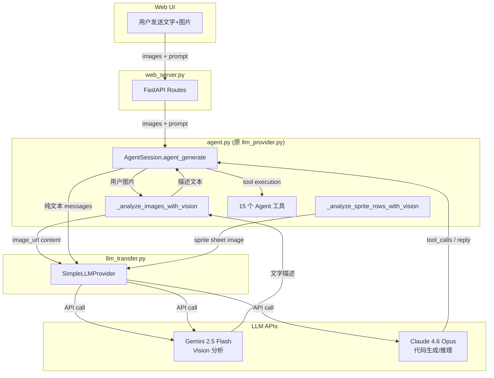

## 用户需求

1. **文件重命名**：将 `vibe_tools/llm_provider.py` 重命名为 `vibe_tools/agent.py`，更新所有引用（代码 import、MEMORY.md 文档等）
2. **图片分析架构重构**：所有用户发送的图片（聊天中附带的截图/图片）都应由 Gemini Flash 工具先分析生成文字描述，再把描述传给 Claude Opus 主 Agent，而不是将图片直接发给 Claude Opus

## 产品概述

GodotVibe 的 AI Agent 采用双模型架构：

- **主 Agent（Claude 4.6 Opus）**：负责代码生成、文字推理、工具调用，不处理图片
- **视觉工具（Gemini 2.5 Flash）**：负责所有图片理解场景（sprite sheet 分析、用户聊天图片描述等），输出文字描述供主 Agent 使用

## 核心功能

1. **文件重命名**：`llm_provider.py` 改名为 `agent.py`，体现其"Agent"本质
2. **用户图片 Vision 中转**：用户发送图片时，先调 Gemini Flash 生成详细文字描述，再将描述（而非图片本身）注入 Claude Opus 的 messages 中
3. **已有 sprite sheet vision 保持不变**：`_analyze_sprite_rows_with_vision` 已经使用 Gemini Flash，无需修改

## 技术栈

- Python 3.9+（现有项目）
- OpenAI 兼容 API（SimpleLLMProvider from llm_transfer.py）
- FastAPI（web_server.py）
- 双 LLM 模型：Claude 4.6 Opus（主 Agent）+ Gemini 2.5 Flash（视觉工具）

## 实现方案

### 策略

采用两步修改：

1. **重命名**：`llm_provider.py` → `agent.py`，纯机械性替换所有引用
2. **Vision 中转**：在 `agent.py` 中新增 `_analyze_images_with_vision()` 函数（复用已有的 `_analyze_sprite_rows_with_vision` 模式），在 `agent_generate()` 入口处将用户图片预处理为文字描述

### 关键技术决策

**图片 → 文字描述的方案**：

在 `AgentSession.agent_generate()` 的图片处理位置（原 lines 3004-3017），改为：

- 调用新函数 `_analyze_images_with_vision(images)` → 返回文字描述列表
- 将每张图片的描述作为纯文本注入 user message（而非 `image_url` content block）
- Claude Opus 只看到文字描述，不接触图片二进制数据

**为什么不改 `SimpleLLMProvider.invoke()`**：图片处理应在 Agent 层面完成，而非 LLM 传输层。`SimpleLLMProvider` 是通用的 OpenAI 兼容客户端，保持其通用性；Vision 中转是 Agent 的业务逻辑。

**Vision 模型常量化**：将 `"gemini-2.5-flash"` 提取为模块级常量 `VISION_MODEL`，供 `_analyze_sprite_rows_with_vision` 和新函数共用，避免分散硬编码。

### 性能考量

- 每张用户图片额外增加一次 Gemini Flash API 调用（通常 1-3 秒/张）
- Gemini Flash 成本远低于 Opus，且图片理解能力足够
- 图片描述替代原始图片后，Claude Opus 的 input token 数大幅减少（一张图片约 300-800 token → 描述约 100-200 token）

## 实现细节

### 重命名操作

- 文件：`vibe_tools/llm_provider.py` → `vibe_tools/agent.py`
- import：`web_server.py` line 37 `from vibe_tools.llm_provider` → `from vibe_tools.agent`
- 文档：`MEMORY.md` 3 处 `llm_provider.py` → `agent.py`
- 模块 docstring：`agent.py` line 10 引用 `llm_transfer.py` 保持不变

### Vision 中转函数

新增 `_analyze_images_with_vision(images: list[str], api_key, base_url) -> list[str]`：

- 复用 `_analyze_sprite_rows_with_vision` 已有模式：创建独立的 `SimpleLLMProvider(model=VISION_MODEL)`
- 对每张图片调 Gemini Flash，prompt 要求详细描述图片内容（UI 截图、游戏画面、错误信息等）
- 返回文字描述列表
- 失败时 fallback 为 `"[Image attached but could not be analyzed]"`

### agent_generate() 修改

原代码（lines 3004-3017）：

```python
if images:
    content_parts = [{"type": "text", ...}]
    for img_data in images:
        content_parts.append({"type": "image_url", ...})
    messages.append({"role": "user", "content": content_parts})
```

改为：

```python
if images:
    descriptions = _analyze_images_with_vision(images, ...)
    text_content += "\n\n" + "\n".join(descriptions)
    messages.append({"role": "user", "content": text_content})
```

### Blast Radius 控制

- `SimpleLLMProvider`（llm_transfer.py）不动
- `GameGenerator` 类名不变
- `web_server.py` 只改 import 路径
- `_analyze_sprite_rows_with_vision` 只改 `vision_model` 变量为常量引用
- 不改 `_estimate_tokens` 中的 image_url token 估算（因为不再有 image_url）

## 架构设计



## 目录结构

```
vibe_tools/
├── agent.py              # [RENAME from llm_provider.py] Agent 游戏生成器。
│                         #   新增: VISION_MODEL 常量、_analyze_images_with_vision() 函数。
│                         #   修改: agent_generate() 图片处理逻辑，从 multimodal 改为 vision 中转。
│                         #   修改: _analyze_sprite_rows_with_vision() 使用 VISION_MODEL 常量。
├── web_server.py         # [MODIFY] import 路径从 llm_provider 改为 agent
├── llm_transfer.py       # [UNCHANGED] SimpleLLMProvider 保持不变
└── ...
MEMORY.md                 # [MODIFY] 3 处 llm_provider.py 引用改为 agent.py
```

## 关键代码结构

```python
# agent.py 模块级常量
VISION_MODEL = "gemini-2.5-flash"

def _analyze_images_with_vision(
    images: list[str],
    api_key: str | None = None,
    base_url: str | None = None,
) -> list[str]:
    """用 Gemini Flash 分析用户图片，返回每张图片的文字描述列表。
    
    Args:
        images: base64 data URI 列表
        api_key: LLM API key
        base_url: LLM base URL
    
    Returns:
        文字描述列表，与 images 一一对应
    """
    ...
```

## Agent Extensions

### SubAgent

- **code-explorer**
- Purpose: 在重命名 `llm_provider.py` 为 `agent.py` 时，全面搜索所有可能的引用点（包括隐藏的 import、文档、注释等），确保不遗漏
- Expected outcome: 确认所有需要更新的文件和行号，避免遗漏导致运行时 ImportError