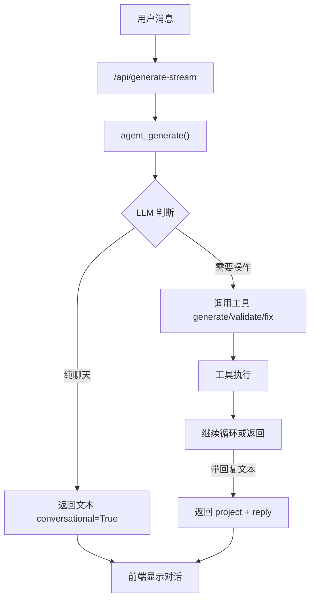

## 用户需求

移除上一轮添加的"意图分类"机制（classify_intent + chat_respond），改为统一的 Agent 交互模式。

## 产品概述

GodotVibe Agent 应该像 AI 编程助手一样工作——用户发送任何消息（聊天、提问、游戏操作请求），Agent 统一处理：

- 纯聊天（"你好"、"项目有什么资产"）→ Agent 直接用自然语言回复，不调用工具
- 操作请求（"做个平台跳跃游戏"）→ Agent 先回复"好的，我来做..."，然后调工具生成/修改，做完后总结
- 聊天和操作交织进行，就像和真人开发者对话一样

## 核心功能

1. **删除意图分类**：移除 `classify_intent()` 和 `chat_respond()` 两个方法，以及 web_server 中的分支逻辑
2. **统一 Agent 入口**：所有消息都走 `agent_generate()` 循环，由 LLM 自行判断是回复文字还是调工具
3. **优化 System Prompt**：让 Agent 成为友好的游戏开发助手，能自然处理聊天、提问、和操作请求
4. **注入聊天历史**：在 agent_generate 中加入 `_chat_history`，支持多轮对话上下文
5. **优化用户消息构造**：不再强制"proceed to generate"，让 Agent 根据用户意图自行决定
6. **前端适配**：确保 conversational 回复和 project 数据的混合场景正确显示
7. **更新 MEMORY.md**：反映新的统一交互模式

## 技术栈

- 后端: Python + FastAPI (现有)
- 前端: 原生 HTML/JS (现有 index.html)
- LLM: OpenAI 兼容 API + 工具调用 (现有)

## 实现方案

### 核心思路

移除额外的意图分类层，让 LLM 的 tool_calls 机制自然充当"意图判断"——当 LLM 认为需要操作时自动调用工具，认为只需聊天时直接返回文本。这是 function calling 的原生能力，无需额外的分类步骤。

### 关键技术决策

1. **为什么移除意图分类而不是优化它**：意图分类增加了一次额外的 LLM 调用（延迟 + 成本），而且容易误判。LLM 的 tool_calls 机制本身就能做"意图判断"——有工具需求时调工具，没有时直接回文本。

2. **chat_history 注入策略**：在 agent_generate 的 messages 列表中，在 system prompt 之后、当前用户消息之前，插入最近 10 条 chat_history 消息。这样 Agent 有对话上下文但不会过长。

3. **用户消息构造优化**：将当前的强制指令式（"If the request is clear, proceed to generate"）改为描述性（"Here is the user's message. Respond naturally — chat if they're chatting, use tools if they want to build/modify something"），让 LLM 自行判断。

## 实现细节

### 注意事项

- **chat_history 保存时机**：agent_generate 返回前，将 user_prompt 和 agent_reply 追加到 `_chat_history`，确保下次调用有上下文
- **conversational 返回值保留**：agent_generate 中已有的 conversational=True 返回路径无需修改，它在 LLM 不调工具时自然触发
- **前端 isChat 逻辑**：当前 `isChat = finalData.conversational && !finalData.project` 的判断基本正确。但需要调整为：当 conversational=True 且有 project 时，同时显示回复文本和更新文件列表（不隐藏 steps）

### 性能优化

- 移除 classify_intent 后，每次请求少一次 LLM 调用，平均节省 1-3 秒延迟
- chat_history 限制为最近 10 条，避免 token 过长

### 向后兼容

- `/api/generate` 非流式端点无需修改（它本来就直接调 agent_generate）
- 前端 sendMessage 无需修改（它本来就调 generate-stream）

## 架构设计



## 目录结构

```
vibe_tools/
├── llm_provider.py      # [MODIFY] 删除 classify_intent() 和 chat_respond()；优化 SYSTEM_PROMPT；在 agent_generate() 中注入 chat_history 并优化 user message 构造
├── web_server.py        # [MODIFY] generate-stream 端点移除意图分类分支，所有消息直接走 agent_generate()
├── static/
│   └── index.html       # [MODIFY] 调整前端 finalData 处理逻辑，确保混合场景（conversational + project）正确显示
MEMORY.md                # [MODIFY] 替换 v0.8.0 意图分类记录为统一模式说明
```

## Agent Extensions

### SubAgent

- **code-explorer**
- Purpose: 在实现过程中验证修改后的代码逻辑正确性，搜索相关引用确保没有遗漏
- Expected outcome: 确认所有 classify_intent/chat_respond 引用都已清理，chat_history 注入位置正确