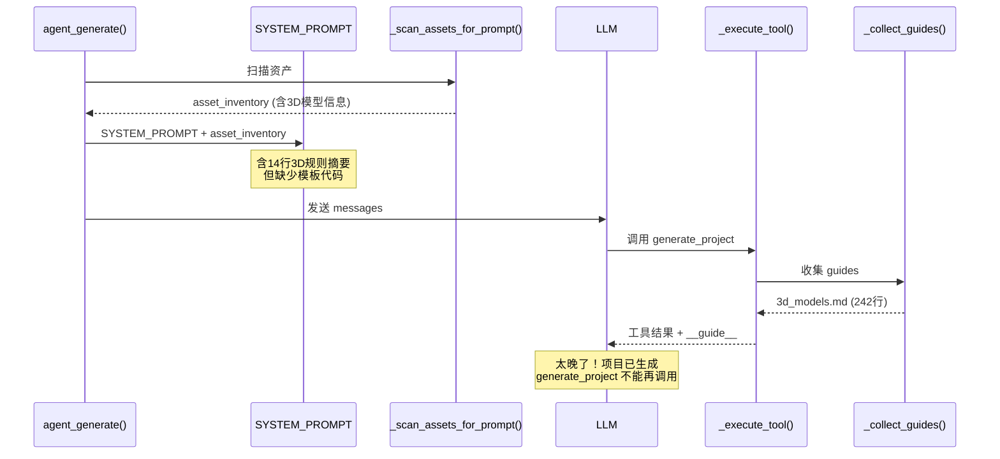
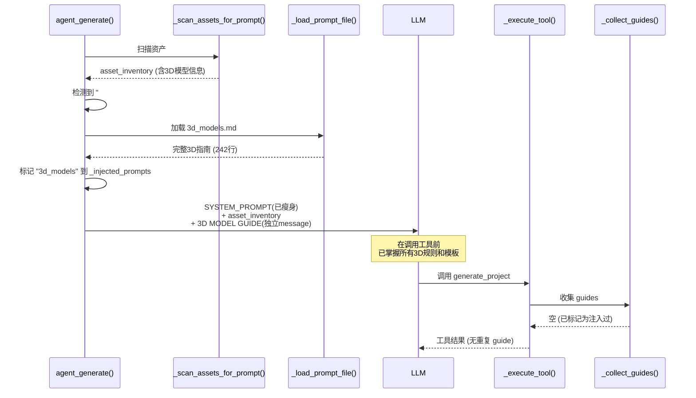

## 用户需求

用户提出两个关联问题：

1. SYSTEM_PROMPT 中包含了大段 3D 模型规则（约14行），浪费系统提示空间。这些规则应在对应工具调用时动态注入，而不是始终占用 system prompt。
2. 实际生成的3D项目质量极差（没有蛇、没有完整3D环境、动画名硬编码），根本原因是 prompt guides 的注入时机错误——在 `generate_project` 执行完毕后才注入 `3d_models.md`，但该工具只能调用一次，LLM 在生成项目时根本看不到详细的3D模型规则和模板代码。

## 产品概述

修复 GodotVibe AI 助手的 prompt 注入机制，让3D模型相关的详细规则在 `generate_project` 工具调用**之前**对 LLM 可见，而非之后。

## 核心功能

1. **从 SYSTEM_PROMPT 移除3D模型大段规则**：删除第1062-1075行的 "3D MODELS / GLB (CRITICAL)" 整个 section，减少 system prompt 体积
2. **基于资产预扫描的 prompt 预注入**：当 `_scan_assets_for_prompt()` 检测到项目中存在 3D 模型文件（.glb/.gltf）时，在构建消息时将 `3d_models.md` 的完整内容预注入到 system prompt 或作为独立 system message，确保 LLM 在调用 `generate_project` 前就能看到所有3D规则和模板代码
3. **去重兼容**：预注入的 prompt 需记录到 `_injected_prompts` 集合中，避免后续工具调用时重复注入同一 guide

## 技术栈

- 语言：Python 3.x
- 现有项目：`vibe_tools/llm_provider.py` — 核心 LLM 提供器
- Prompt 文件：`vibe_tools/prompts/3d_models.md`（242行完整3D模型指南）
- 去重机制：`self._injected_prompts: set[str]`

## 实现方案

### 策略概述

当前流程的问题在于：`_collect_guides()` 在 `_execute_tool()` 中被调用，将 prompt guides 追加到工具**结果**中。对于 `generate_project` 这种一次性工具，LLM 调用时还看不到 guides，执行完后注入已经太晚。

解决方案分两步：

1. **瘦身 SYSTEM_PROMPT**：移除第1062-1075行的3D模型规则 section
2. **在 `agent_generate()` 中预注入**：利用已有的 `_scan_assets_for_prompt()` 返回的资产扫描结果，判断是否存在3D模型。如果有，加载 `3d_models.md` 并作为独立 system message 注入到 messages 列表中（在 user message 之前），同时标记到 `_injected_prompts` 以防重复

### 关键技术决策

1. **预注入方式选择：独立 system message vs 追加到 asset_inventory**

- 选择**独立 system message**。原因：`3d_models.md` 有242行（含完整模板代码），混入 asset_inventory 会导致资产列表过长、注意力分散。作为独立 system message 可以有清晰的标题（如 "3D MODEL GUIDE"），LLM 更容易识别并遵循。
- 位置：放在 asset inventory message 之后、chat history 之前，确保 LLM 在收到用户消息前就掌握3D规则。

2. **何时预注入：基于 `_scan_assets_for_prompt()` 的返回值检测**

- `_scan_assets_for_prompt()` 内部已经分类了 `models = [a for a in assets if a["category"] == "model"]`。需要让该方法返回一个额外信号（或修改 `agent_generate()` 让它自己判断 asset_inventory 文本中是否含 "3D Models" 标题）。
- 更简单的方式：在 `agent_generate()` 中检查 `asset_inventory` 字符串是否包含 `"### 3D Models"` 这个标题（由 `_scan_assets_for_prompt()` 在检测到 models 时生成）。这避免修改 `_scan_assets_for_prompt()` 的接口。

3. **去重保证**

- 预注入时将 `"3d_models"` 加入 `self._injected_prompts`，后续 `_collect_guides()` 在处理 `generate_project` 或其他工具时发现已注入，自动跳过。

### 性能与可靠性

- **Token 消耗**：仅在项目含3D模型时才注入 `3d_models.md`（~242行 ≈ ~1K tokens），对2D项目无影响。移除 SYSTEM_PROMPT 中的14行3D规则，对所有项目都减少 ~200 tokens。
- **向后兼容**：2D项目完全不受影响。3D项目的 prompt 注入从"工具结果事后注入"变为"system message 预注入"，功能等价但时机提前。
- **去重正确性**：`_injected_prompts` 在 `agent_generate()` 开头被重置（行2881区域），而预注入在重置之后执行，所以不会有残留问题。

## 实现注意事项

1. **精确删除 SYSTEM_PROMPT 中的3D规则**：只删除第1062-1075行（从 `## 3D MODELS / GLB (CRITICAL):` 到最后一行 `- **Model facing**:...`），保留其上方的 ASSET LOADING section 和下方的结束引号 `"""`。
2. **`_scan_assets_for_prompt()` 不需要修改接口**：它已经在检测到3D模型时输出 `### 3D Models` 标题，`agent_generate()` 只需检查字符串即可判断。
3. **`_load_prompt_file("3d_models")` 已有现成函数**，直接复用。
4. **不要移除 `_get_dynamic_prompts()` 中对 `generate_project` 的3D检测逻辑**——它在去重后不会重复注入，但作为防御性代码保留，对其他路径（如 `write_file` / `patch_file` 写3D相关文件）仍有作用。

## 架构设计

### 当前流程（有问题）



### 修复后流程



## 目录结构

```
vibe_tools/
└── llm_provider.py  # [MODIFY] 1) 移除 SYSTEM_PROMPT 第1062-1075行的3D模型规则
                     #          2) 在 agent_generate() 中，asset_inventory 含3D模型时
                     #             预注入 3d_models.md 为独立 system message
                     #             并标记 _injected_prompts 防止重复
```

只需修改一个文件，改动集中在两个位置。

## Agent Extensions

### SubAgent

- **code-explorer**
- Purpose: 在实施前验证 `agent_generate()` 中 `_injected_prompts` 重置的确切位置，以及确认 asset_inventory 中 3D Models 标题的精确格式
- Expected outcome: 确认修改点的精确行号和上下文，避免实施时遗漏边界条件